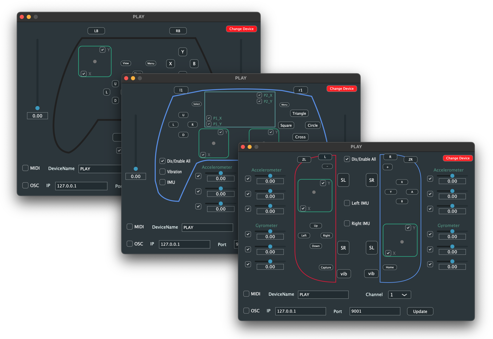

# PLAY

This repository houses the PLAY application, designed to transform video game controllers (VGCs) into dynamic musical instruments. The PLAY app converts the input signals from VGCs into MIDI and/or OSC messages, facilitating their use in musical performance and composition.

     

## Table of Contents
- [Features](#features)
- [Installation](#installation)
- [Usage](#usage)
- [Mapping Guide](#mapping-guide)
- [Contributing](#contributing)
- [License](#license)
- [Credits](#credits)
- [Project Team](#project-team)
- [References](#references)

## Features
- **VGC Support**: Compatible with wired and Bluetooth VGCs including Xbox wireless controller, PS5 Dualsense controller, and Nintendo Switch Joycons.
- **IMU Support**: Option to enable/disable the controller's IMU accelerometer and gyroscope.
- **GUI and Visuals**: GUI and visual feedback for VGC input signals.
- **Customization**: Customizable MIDI channel and OSC receiver IP/port for tailored integration into musical setups.
- **Signal Conversion**: Ability to convert input signals into either MIDI or OSC messages, or both.
- **PS5 Dualsense adaptive trigger**: Custom the Dualsense controller triggers resistance.

## Installation
1. Navigate to the [GitHub release page](https://github.com/HongshuoFan/PLAY/releases).
2. Download the latest software package (currently available for macOS).
3. Extract the contents of the package.
4. Drag and drop the PLAY app into your Applications folder.

*Note*: If you encounter a warning about unidentified developers, refer to [this Apple support page](https://support.apple.com/en-gb/guide/mac-help/mh40616/13.0/mac/13.0) for assistance.

## Usage
1. Connect the controller to your computer via pairing or USB connection.
2. Launch the PLAY app.
3. Use the dropdown menu to select your controller.
4. Activate MIDI and/or OSC output as needed.

*Optional*: Toggle the controller's IMU features according to your preferences.

## Mapping Guide:

### Xbox Wireless Controller

Controller Input  |  MIDI Message | OSC Address     |
|-----------------|---------------|-----------------    |
Button A          |  Note 36      |  /buttons/a         |
Button B          |  Note 37      |  /buttons/b         |
Button X          |  Note 38      |  /buttons/x         |
Button Y          |  Note 39      |  /buttons/y         |
Dpad Up           |  Note 40      |  /dpad/up           |
Dpad Down         |  Note 41      |  /dpad/down         |
Dpad Left         |  Note 42      |  /dpad/left         |
Dpad Right        |  Note 43      |  /dpad/right        |
Button Lb         |  Note 44      |  /buttons/lb        |
Button Rb         |  Note 45      |  /buttons/rb        |
Button view       |  Note 46      |  /buttons/view      |
Button Share      |  Note 47      |  /buttons/share     |
Button menu       |  Note 48      |  /buttons/menu      |
Left stick press  |  Note 49      |  /leftStick/press   |
Right stick press |  Note 50      |  /rightStick/press  |
Left trigger      |  MIDI CC 1    |  /leftTrigger       |
Right trigger     |  MIDI CC 2    |  /rightTrigger      |
Left stick X      |  MIDI CC 7    |  /leftStick/x       |
Left stick Y      |  MIDI CC 8    |  /leftStick/y       |
Right stick X     |  MIDI CC 10   |  /rightStick/x      |
Right stick Y     |  MIDI CC 11   |  /rightStick/y      |

### PS5 Dualsense controller

Controller Input  |  MIDI Message | OSC Address     |
|-----------------|---------------|-----------------   |
Button Cross      |  Note 36      |  /buttons/cross    |
Button Circle     |  Note 37      |  /buttons/circle   |
Button Square     |  Note 38      |  /buttons/square   |
Button Triangle   |  Note 39      |  /buttons/triangle |
Dpad Up           |  Note 40      |  /dpad/up          |
Dpad Down         |  Note 41      |  /dpad/down        |
Dpad Left         |  Note 42      |  /dpad/left        |
Dpad Right        |  Note 43      |  /dpad/right       |
Button L1         |  Note 44      |  /buttons/l1       |
Button R1         |  Note 45      |  /buttons/r1       |
Button select     |  Note 46      |  /buttons/select   |
Button menu       |  Note 47      |  /buttons/menu     |
Left stick press  |  Note 48      |  /leftStick/press  |
Right stick press |  Note 49      |  /rightStick/press |
TouchPad Press    |  Note 50      |  /buttons/touchPad |
TouchPad Point1   |  Note 51      |  /touchPoint1/down |
TouchPad Point2   |  Note 52      |  /touchPoint2/down |
Left trigger      |  MIDI CC 1    |  /leftTrigger      |
Right trigger     |  MIDI CC 2    |  /rightTrigger     |
Left stick X      |  MIDI CC 7    |  /leftStick/x      |
Left stick Y      |  MIDI CC 8    |  /leftStick/y      |
Right stick X     |  MIDI CC 10   |  /rightStick/x     |
Right stick Y     |  MIDI CC 11   |  /rightStick/y     |
TouchPad Point1 X |  MIDI CC 12   |  /touchPoint1/x    |
TouchPad Point1 Y |  MIDI CC 13   |  /touchPoint1/y    |
TouchPad Point2 X |  MIDI CC 14   |  /touchPoint2/x    |
TouchPad Point2 Y |  MIDI CC 15   |  /touchPoint2/x    |
Gyroscope X       |  MIDI CC 16   |  /gyroscope/x      |
Gyroscope Y       |  MIDI CC 17   |  /gyroscope/y      |
Gyroscope Z       |  MIDI CC 18   |  /gyroscope/z      |
Accelerometer X   |  MIDI CC 19   |  /accelerometer/x  |
Accelerometer Y   |  MIDI CC 20   |  /accelerometer/y  |
Accelerometer Z   |  MIDI CC 21   |  /accelerometer/z  |

### Nintendo Switch Joycons
*Coming soon*
 
## Contributing

Contributions to the PLAY project are welcome! If you encounter any issues or have ideas for improvements, please submit them as GitHub issues or create a pull request with your proposed changes.

## License

PLAY is licensed under the [GPL-3.0](LICENSE). You are free to use and distribute the software in accordance with the terms of the license. If you use this in your project kindly give credit to the team.

## Credits 

Special thanks to [The Oxford Research Centre in the Humanities (HCP)](https://www.torch.ox.ac.uk/humanities-cultural-programme), Jesus College Oxford, and the [Royal Northern College of Music](https://www.rncm.ac.uk/) for their support and funding.

## Project Team
- Dr. Robert Laidlow: [robert.laidlow@jesus.ox.ac.uk](mailto:robert.laidlow@jesus.ox.ac.uk)
- Dr. Hongshuo Fan: [hongshuo.fan@rncm.ac.uk](mailto:hongshuo.fan@rncm.ac.uk)
- Dr. Bofan Ma: [bofan.ma@rncm.ac.uk](mailto:bofan.ma@rncm.ac.uk)
- Ellen Sargen: [ellensargen@gmail.com](mailto:ellensargen@gmail.com)

## References
- [JUCE Framework](https://github.com/juce-framework/JUCE)
- [JoyShockLibrary](https://github.com/JibbSmart/JoyShockLibrary)
- [DualSense Windows API](https://github.com/Ohjurot/DualSense-Windows)
- [DS4Windows](https://github.com/Ryochan7/DS4Windows)
- [Nintendo Switch Reverse Engineering](https://github.com/dekuNukem/Nintendo_Switch_Reverse_Engineering)

